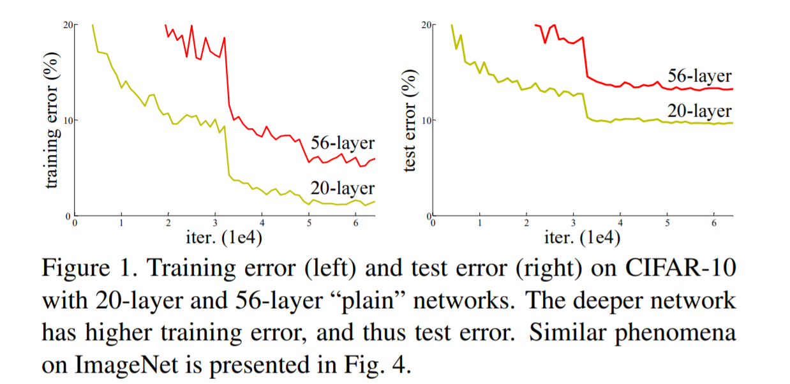
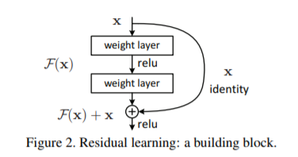

# 딥러닝 초보가 이해한 ResNet
[ResNet arxiv 논문](https://arxiv.org/pdf/1512.03385.pdf)  
*수학적인 개념이 어렵지는 않다. 맥락을 파악하는게 어려웠을뿐.. :)*
## Introduction
기존의 CNN은 layer가 깊어지면 여러가지 문제가 발생했다.
1. vanishing/exploding gradients problem
    * 이 문제는 이후 normalized intialization과 intermediate normalization layers에 의해 해결되었다.
2. 그러나 degradation problem가 나타났다.
    * depth가 증가함에 따라, accuracy는 증가하다가(당연한 소리지만) 급격히 감소한다(!).
    * layer가 증가함에 따라, 오히려 error가 증가하는 모습을 보였다.  
    
3. 이를 해결할 수 있는 방법이 바로 residual learning이다 이말이야..!  
    
    * 이 부분은 일반적인 CNN의 일부 레이어를 잘라다가 놓은것이다.
    * 우리는 input x와 레이어의 output H(x)를 같게 만들어주고 싶다. 레이어의 깊이가 길어지더라도 사이 사이에 있는 x와 H(x)가 같다면, degradation problem을 해결하면서도 레이어가 깊어지는 것을 고려해볼 수 있다!
    * 그래서 H(x)-x를 F(x)로 놓고, F(x)을 최소화 하는 방향으로 학습을 시킨다면, 레이어는 깊어지면서 degradation problem도 해결할 수 있을 것이다.
4. 그거 다 뇌피셜 아니냐고?
    * 이 가설로 ILSVRC 2015 classification problem에서 1등 했다구 한다. 결과로 보여주는 편이야~!
## Deep Residual Learning
### Residual Learning

## Implementation
### CIFAR10
* CIFAR10 데이터를 활용해 resnet을 구현하고 성능을 측정했다.

## Reference
* [ResNets for CIFAR-10](https://towardsdatascience.com/resnets-for-cifar-10-e63e900524e0)
* [arxiv paper](https://arxiv.org/pdf/1512.03385.pdf)
* [CNN inception](https://github.com/hunkim/PyTorchZeroToAll/blob/master/11_1_toy_inception_mnist.py)
* [top-k error in pytorch](https://discuss.pytorch.org/t/imagenet-example-accuracy-calculation/7840)